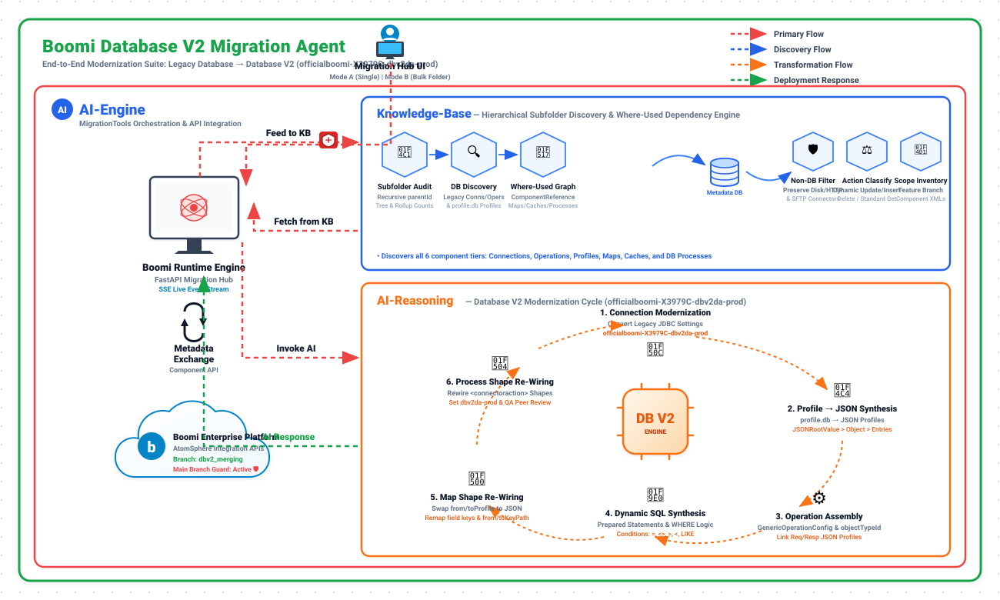

# DB_Migration: Dell Boomi Database V2 Migration Hub & Agent Skills

An end-to-end automated and guided migration suite for Dell Boomi legacy Database connectors to modern Database V2 (`officialboomi-X3979C-dbv2da-prod`).

---

## 📐 System Architecture



---

## 🚀 Overview

Transitioning enterprise Boomi integration architectures from legacy Database connectors to Database V2 involves complex dependencies across multiple component layers. This repository provides:
- **Interactive Migration Web Hub**: Real-time FastAPI and Web-based UI for single-process and bulk-folder discovery, dependency resolution, and automated migration.
- **Agentic AI Skills**: Standardized skills for autonomous AI coding agents to discover, audit, migrate, rewire, and review Boomi processes.
- **Database V2 Engine**: Automated conversion of DB connections, operations (standard & dynamic SQL), JSON request/response profiles, mapping updates, and process shapes.
- **Enterprise Safety Guards**: Strict branch isolation with built-in `main` branch protection to prevent unintended production modifications.

---

## 📦 Repository Structure

```text
DB_Migration/
├── .agents/
│   └── skills/
│       ├── boomi-db-migration/     # End-to-end migration instructions & checklists
│       └── boomi-code-review/      # Boomi integration QA & best practices review
├── boomi-integration/              # Full reference guides, schemas, and automation scripts
│   ├── references/                 # Detailed XML schemas for Boomi components & shapes
│   └── scripts/                    # Shell scripts for platform interactions & diffing
├── boomi_migration_agent/          # Migration application core
│   ├── server.py                   # FastAPI backend server with SSE streaming
│   ├── migration_tools.py          # Core migration transformation engine
│   ├── boomi_client.py             # Authenticated Boomi Platform API client
│   ├── agent.py                    # Standalone Agent workflow handler
│   ├── static/                     # Web Hub UI (HTML, CSS, JS)
│   └── templates/
├── active-development/             # Component templates and active XML definitions
├── .env.example                    # Environment credentials template
└── README.md
```

---

## 🛠️ Key Capabilities

### 1. Automated Discovery & Audit
- Scans legacy database connections (`connector-settings`), operations (`connector-action`), and profiles (`profile.db`).
- Performs recursive where-used dependency analysis to detect referencing Maps, Document Caches, and Integration Processes.
- Generates detailed multi-sheet audit summaries and migration plans.

### 2. Intelligent Database V2 Conversion
- **Connections**: Converts legacy database connection URLs and drivers to Database V2 Generic configurations.
- **Operations & Profiles**:
  - Automatically synthesizes SQL prepared statements and parameter bindings.
  - Dynamically constructs JSON Request Profiles and standard Database V2 Response Profiles (`Query`, `Rows Effected`, `Status`).
  - Supports `Dynamic Insert`, `Dynamic Update` (with condition operators: `=`, `<>`, `>`, `<`, etc.), `Dynamic Delete`, and `Standard Get/Execute`.
- **Maps**: Rewires legacy Database Profile mappings directly to newly minted JSON Profile element keys.
- **Process Shapes**: Rewires `<connectoraction>` process steps to Database V2, configuring connection IDs, operation IDs, and action parameters.

### 3. Branch Isolation & Main Branch Guard
- Supports working on dedicated feature/development branches (e.g. `dbv2_merging`).
- Automatically intercepts and blocks operations targeted at `main` to safeguard production integration components.

---

## ⚙️ Quick Start

### 1. Prerequisites
- Python 3.10+
- Valid Dell Boomi account credentials (API Token, Username, Account ID)

### 2. Installation
```bash
git clone https://github.com/Balarama2002/DB_Migration.git
cd DB_Migration
pip install fastapi uvicorn requests pydantic openpyxl
```

### 3. Configure Credentials
Copy `.env.example` to `.env` and fill in your AtomSphere credentials:
```bash
cp .env.example .env
```
```ini
BOOMI_API_URL=https://api.boomi.com
BOOMI_USERNAME=your_username@example.com
BOOMI_API_TOKEN=your_api_token
BOOMI_ACCOUNT_ID=your_account_id
```

### 4. Run the Migration Hub
```bash
python -m uvicorn boomi_migration_agent.server:app --host 127.0.0.1 --port 8000
```
Open [http://127.0.0.1:8000](http://127.0.0.1:8000) in your web browser.

---

## 🤖 Agent Skills Included

| Skill | Path | Description |
| :--- | :--- | :--- |
| **Boomi DB Migration** | `.agents/skills/boomi-db-migration` | Complete multi-phase instructions for scanning, profile mapping, map re-wiring, and process updating. |
| **Boomi Code Review** | `.agents/skills/boomi-code-review` | Code quality verification, shape labeling, error catching, and configuration standards. |
| **Boomi Integration** | `boomi-integration/SKILL.md` | Comprehensive operational reference, component schemas, and CLI utilities. |

---

## 📄 License
Internal enterprise integration migration utility.
