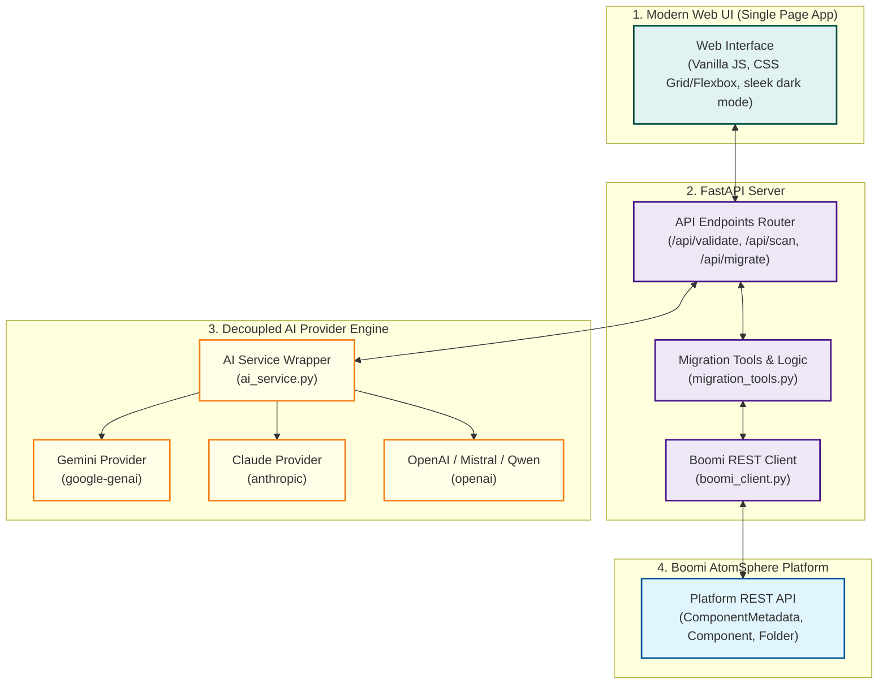

# Boomi Legacy Database Migration Agent: Implementation Plan & Web UI Architecture

We are adding a modern, responsive Web User Interface (UI) to the Boomi Migration Agent, introducing support for decoupled AI engines (Gemini, Claude, OpenAI, Qwen, Mistral), targeted folder migration filtering, and duplicate profile creation prevention.

---

## 1. Updated Architecture Diagram (CEO / CTO Level)



---

## 2. Proposed Changes & Design Decisions

### A. Prevention of Duplicate Profiles & Operations
*   **Problem**: Retriggering the migration currently creates multiple duplicate JSON profiles (e.g. `Get_Data_DB_JSON 2`, `3`) because the script calls `/Component` (Create) unconditionally.
*   **Solution**: In `migration_tools.py`, query `ComponentMetadata` to check if a component with the same name, type, and folder path already exists on the platform. If it exists, reuse the existing component ID instead of creating a new one.

### B. Decoupled AI Engine (`ai_service.py`)
*   **Design**: Create a unified `AIService` class under `boomi_migration_agent/ai_service.py` that wraps:
    *   **Gemini** via `google-genai`
    *   **Claude** via `anthropic`
    *   **OpenAI/Qwen/Mistral** via `openai`
*   The UI will allow the user to select their provider and supply the corresponding API key, which will be routed through the server dynamically.

### C. FastAPI Backend Web Server
*   Create a web server in `boomi_migration_agent/server.py` containing endpoints:
    *   `POST /api/validate`: Validates Boomi account status by executing a query.
    *   `POST /api/scan`: Runs Phase 1 scan and extracts legacy database connection structures, operations, profiles, and where-used lists.
    *   `POST /api/migrate`: Executes the migration dynamically, supporting a targeted folder name filter. If specified, only components in that folder are migrated.
    *   `GET /api/download-report`: Generates and serves the legacy audit report.
    *   `GET /api/download-migration-report`: Serves the walkthrough completion report.

### D. Responsive Glassmorphic Web UI
*   Create an index.html and style.css for a state-of-the-art web interface with:
    *   **Theme**: Dark futuristic mode with blue/teal gradients.
    *   **Credentials Validator**: Validates account credentials instantly with clear validation messages.
    *   **Interactivity**: Expandable tables, dependency trees, targeted folder input, and a real-time console logger.
    *   **Export**: Built-in download features.

---

## 3. Verification Plan

### Automated & Manual Tests
*   Run the FastAPI server locally:
    ```powershell
    python boomi_migration_agent/server.py
    ```
*   Open the UI in the browser, input active credentials, and click "Validate".
*   Scan the components, check the folder filtering behavior, and verify the resulting connections/operations are reusable (zero duplicate creation).
